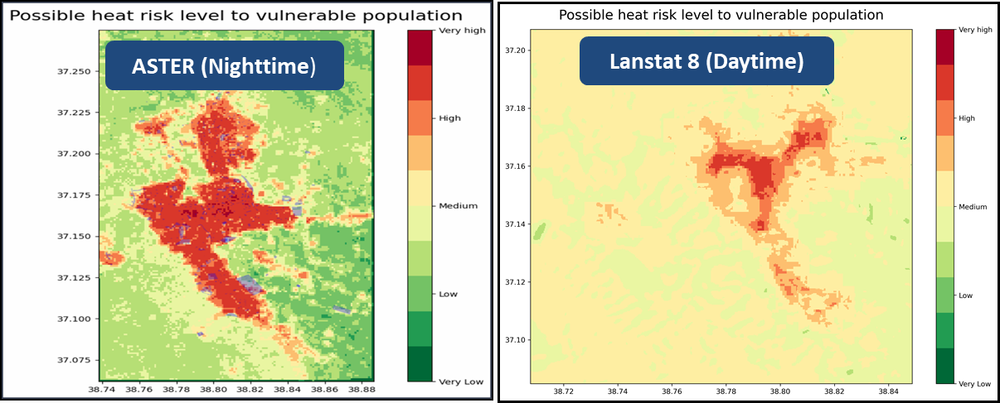

**Improving Land Surface Temperature (LST) Maps Using Nighttime Images**

Land Surface Temperature (LST) is a key indicator for analyzing
heatwaves and the urban heat island (UHI) effect, which refers to higher
surface and air temperatures in urban areas compared to their rural
surroundings.

In the CLIMAAX Heatwave Risk Assessment Workflow, we use satellite-based
LST images as the exposure component. The workflow currently defines the
Landsat 8 image download methodology and related codes.

At the **Şanlıurfa Metropolitan Municipality**, we have already applied
Landsat 8 datasets for daytime observations during the summer season.
However, since daytime land surface temperatures often exceed 60°C and
are distributed relatively homogeneously across the city center, it was
not possible to effectively visualize temperature variations or the
urban heat island effect.

Therefore, we searched for another data source providing nighttime LST
images. Two of the most widely used satellite sources for LST data are
Terra ASTER (Advanced Spaceborne Thermal Emission and Reflection
Radiometer) and Landsat 8 (Thermal Infrared Sensor – TIRS).

Below is a comparison of their sensor and data characteristics:

| **Feature** | **Terra ASTER** | **Landsat 8 (TIRS)** |
|----|----|----|
| Satellite Platform | Terra (NASA, launched 1999) | Landsat 8 (NASA/USGS, launched 2013) |
| Spatial Resolution | 90 meters | 30 or 100 meters |
| Day/Night Imagery | Day or Night | Daytime only |
| Data format | GeoTiff/HDF | GeoTiff |
| LST Unit | Kelvin | Degrees Celcius |
| Data-Source | NASA Earthdata Search | RSLab Landsat LST |
| URL | <https://search.earthdata.nasa.gov/> | <https://rslab.gr/Landsat_LST.html> |

**Why Terra ASTER Instead of Landsat 8?**

Landsat 8 offers consistent global coverage and good temporal
consistency but has fewer thermal bands and generally only provides
daytime acquisitions. For city-scale UHI studies, ASTER’s 90 m thermal
data is better suited to detect local temperature variations between
urban structures and vegetated areas. ASTER’s ability to acquire both
daytime and nighttime thermal images is a major advantage. Nighttime LST
helps capture residual heat storage in built-up areas and provides
clearer contrasts between urban and rural surfaces. This makes ASTER
data more convenient and reliable for visualizing and quantifying the
urban heat island effect, especially in densely built city centers.

**Main disadvantages of ASTER Data**

- Data analysis is more complex than for Landsat 8.

- A simple additional code is required to convert the LST unit from
  Kelvin to degrees Celsius.

- Preloaded “granules” should be clipped for desired area of concern.

In Şanlıurfa, we compared both data sources over the same location using
ASTER nighttime and Landsat 8 daytime maps. The results clearly
demonstrated that nighttime ASTER imagery provides a more effective
visualization of the urban heat island effect.


We have improved the Climaax Heatwave Risk Map of Şanlıurfa MM city
center by applying ASTER’s nighttime LST data-sets:



**Step by Step Data Processing (We applied)**

1\. Go to : <https://search.earthdata.nasa.gov/>

2\. Sign in.

3\. Search data source “ASTER Surface Kinetic Temperature”

4\. Select data source “ASTER L2 Surface Kinetic Temperature V003”

5\. “Spatial” function: Navigate in the map, locate the Region and draw
a polygon or circle.

6\. “Temporal” function: Define the temporal period as 01.07 to 31.08 of
e.g. 2020-2025 (tick «Use a recurring date range» box)

7\. Select «Night»

8\. Select the best preloaded «granule» covering our region. Probably
much bigger than our area of interest. Select «GeoTiff» as file format.
“Download” the selected granule (image). Requested image data will be
sent via e-mail within a day

9\. The incoming ASTER image file cannot be used directly in the
workflow.

The following preprocessing steps are required:

- Convert the temperature values from Kelvin to Celsius.

- Since the file covers a very large area, it needs to be clipped to the
  study area.

The software we used for this study is ArcMAP version 10.8. It is a
desktop GIS software developed by Esri. This screen shows the appearance
of the Aster satellite image within the software.

10\. Since the surface temperature of the downloaded satellite image is
in Kelvin, we need to convert it to Celsius. To do this, we use the
Raster Calculator tool. After opening the tool, in the calculation field
we enter:

```("file_name.tif" \* 0.1) - 273.15```

and then select the folder where the new file will be saved.

11\. Since the obtained image is very large, we need to cut it according
to our study area. To do this, we created a shapefile (shp) centered on
our study area. The square visible on the screen is centered on
Şanlıurfa. In ArcMap, we open the Image Analysis tool. we select our
study area. In the Image Analysis tool, we choose the image we want to
clip (After conversion). Then, in the Processing section, the desired
area is clipped.

12\. Change the coordinate system of the clipped image. The reason for
this step is to align it with the coordinate system of the population
data in the workflow, ensuring that the workflow functions correctly. To
do this, we used the Project Raster tool to change the image’s
coordinate system. The output coordinate system is GCS_WGS_1984.

13\. If the image name is incorrect, it causes an error in the workflow.
Therefore, the image name needs to be changed. All files should be saved
under the LST Folder.

14\. The file — the updated ASTER image — is now ready and working
properly in the workflow.

**Conclusion**

The results clearly demonstrated that nighttime ASTER imagery provides a
more effective visualization of the urban heat island effect. But data
analysis is more complex than for Landsat 8.

We hope that, temperature conversion from Kelvin to Celsius and clipping
operation can be performed within in the workflow by means of additional
codes instead of manual ArcGIS operations.

**For further explanation and contact:**

**İhsan Topallı:** <ihsan@topalli-ai.com>

**İzzettin Karabulut:** <karabulut6363@gmail.com>

**Tamer Atalay:** tamer@atalayconsulting.com
